# Testing

> [!NOTE]  
> Return back to the [README.md](README.md) file.

## Code Validation

### HTML

I have used the recommended [HTML W3C Validator](https://validator.w3.org) to validate all of my HTML files.

| Directory | File | URL | Screenshot | Notes |
| --- | --- | --- | --- | --- |
| home | [index.html](https://github.com/AlexThoma5/MP4_ecommerce/blob/main/home/templates/home/index.html) | [W3C Link](https://validator.w3.org/nu/?doc=https%3A%2F%2Fmp4-ecommerce-390faaa8fcde.herokuapp.com%2F) | 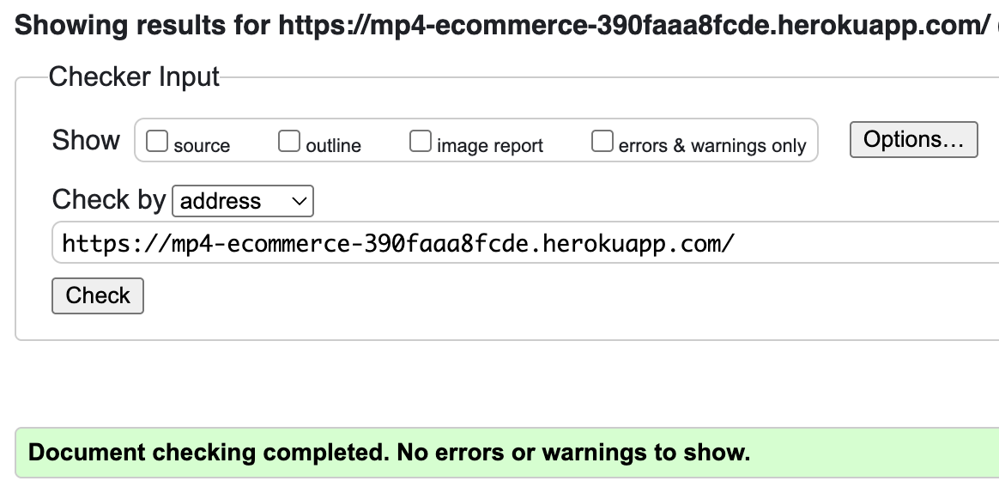 | |
| services | [services.html](https://github.com/AlexThoma5/MP4_ecommerce/blob/main/services/templates/services/services.html) | N/A | 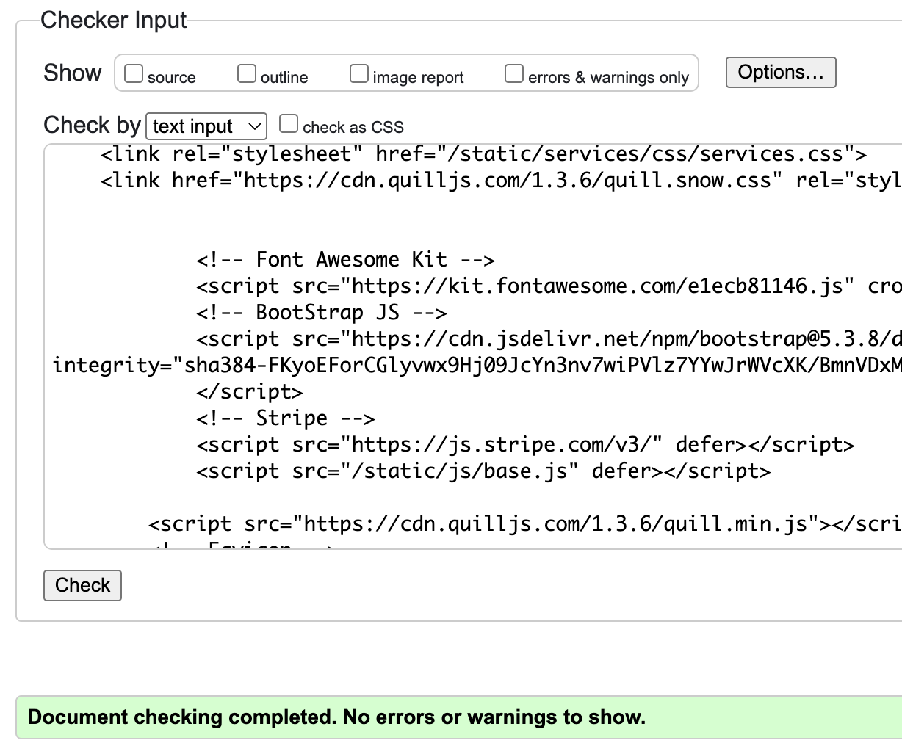 | Validated by direct input - No link, Includes service-modal.html and delete-modal.html |
| services | [service_detail.html](https://github.com/AlexThoma5/MP4_ecommerce/blob/main/services/templates/services/service_detail.html) | [W3C Link](https://validator.w3.org/nu/?doc=https%3A%2F%2Fmp4-ecommerce-390faaa8fcde.herokuapp.com%2Fservices%2F8%2F) | 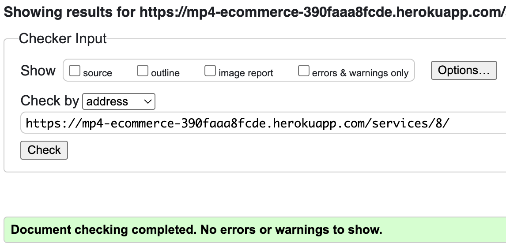 | |
| bag | [bag.html](https://github.com/AlexThoma5/MP4_ecommerce/blob/main/bag/templates/bag/bag.html) | [W3C Link](https://validator.w3.org/nu/?doc=https://mp4-ecommerce-390faaa8fcde.herokuapp.com/bag/&out=html) | 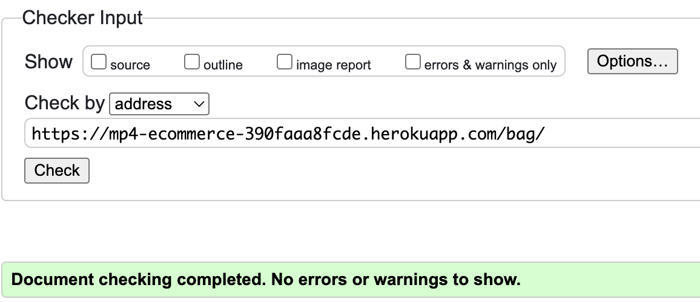 | |
| checkout | [checkout.html](https://github.com/AlexThoma5/MP4_ecommerce/blob/main/checkout/templates/checkout/checkout.html) | N/A | 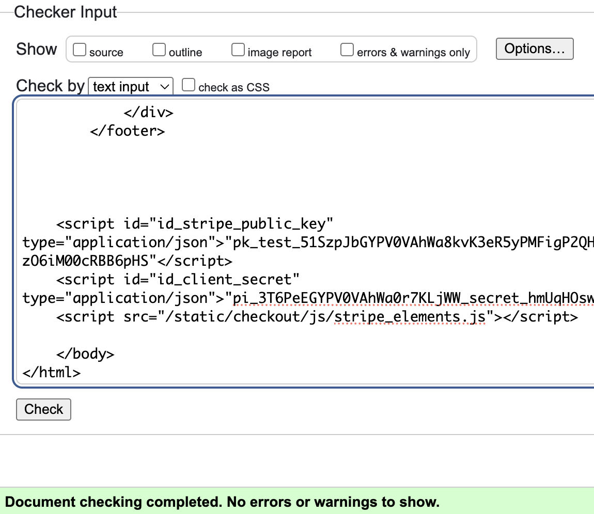 | Validated by direct input - No link |
| checkout | [checkout_success.html](https://github.com/AlexThoma5/MP4_ecommerce/blob/main/checkout/templates/checkout/checkout_success.html) | N/A | 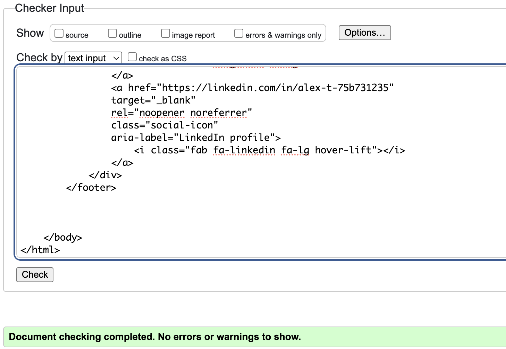 | Validated by direct input - No link |
| contact | [contact.html](https://github.com/AlexThoma5/MP4_ecommerce/blob/main/contact/templates/contact/contact.html) | [W3C Link](https://validator.w3.org/nu/?doc=https://mp4-ecommerce-390faaa8fcde.herokuapp.com/contact/&out=html) | 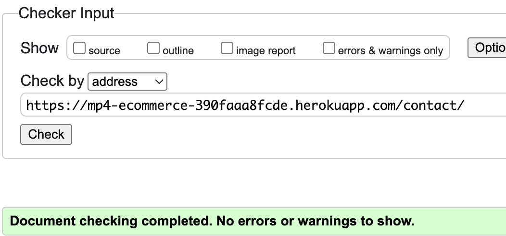 | |
| profiles | [profile.html](https://github.com/AlexThoma5/MP4_ecommerce/blob/main/profiles/templates/profiles/profile.html) | N/A | 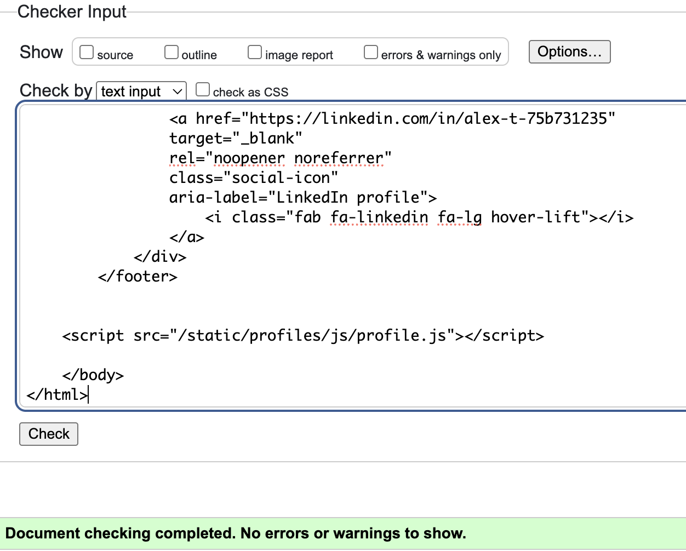 | Validated by direct input - No link, includes edit-contact-modal.html |
| templates | [400.html](https://github.com/AlexThoma5/MP4_ecommerce/blob/main/templates/errors/400.html) | N/A | 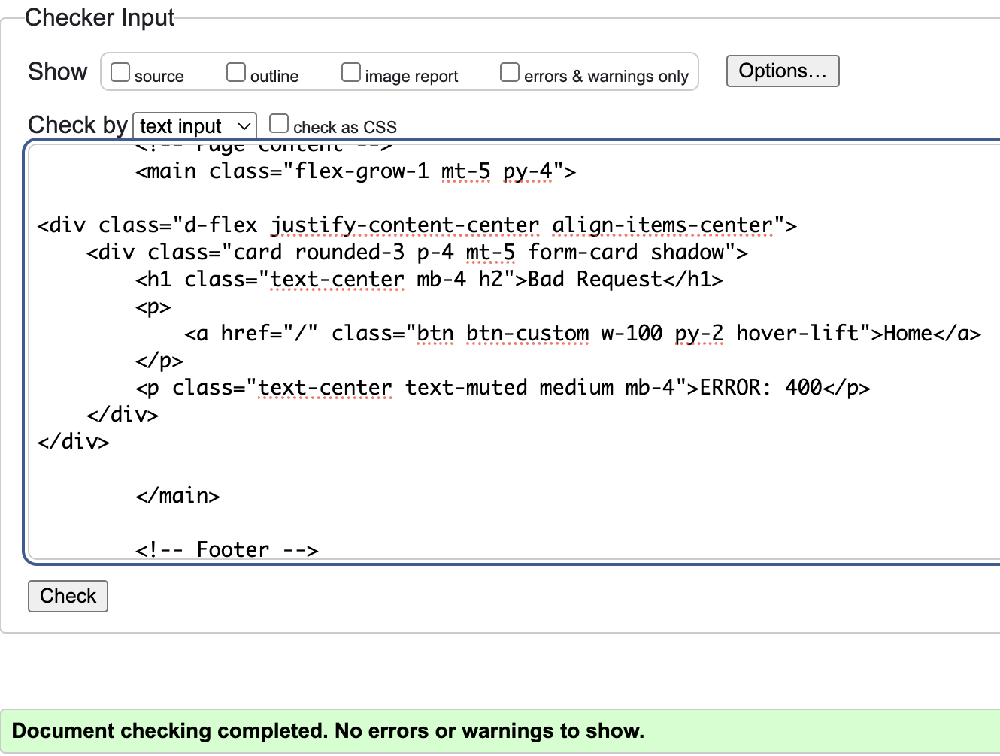 | Validated by direct input - No link |
| templates | [403.html](https://github.com/AlexThoma5/MP4_ecommerce/blob/main/templates/errors/403.html) | N/A | 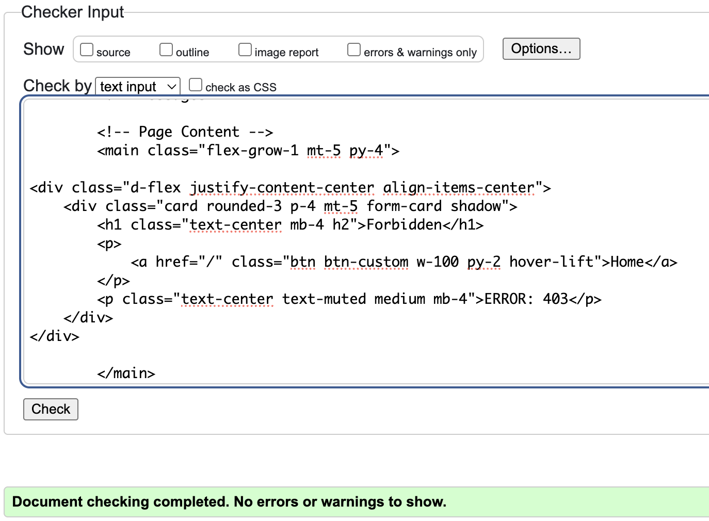 | Validated by direct input - No link |
| templates | [404.html](https://github.com/AlexThoma5/MP4_ecommerce/blob/main/templates/errors/404.html) | N/A | 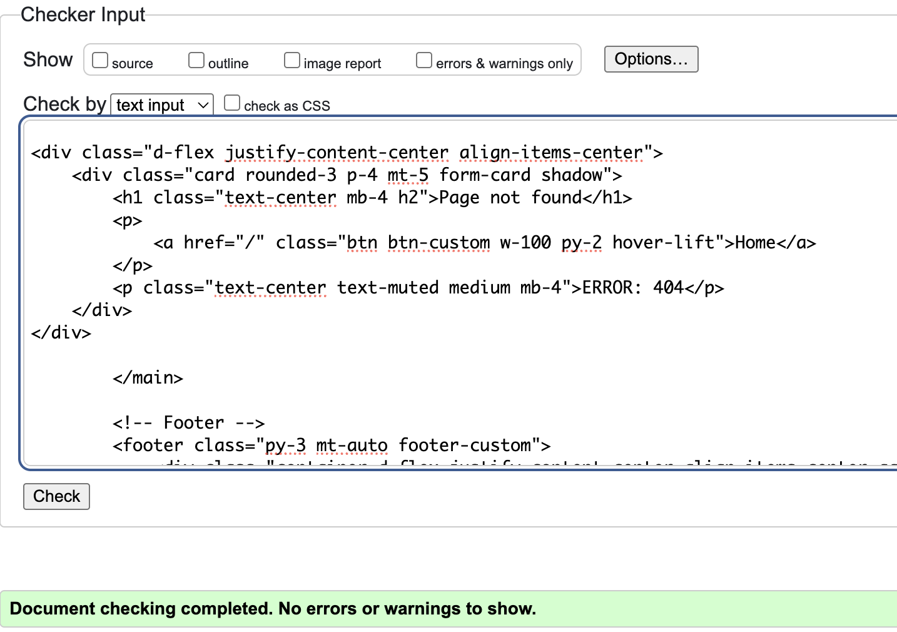 | Validated by direct input - No link |
| templates | [500.html](https://github.com/AlexThoma5/MP4_ecommerce/blob/main/templates/errors/500.html) | N/A | 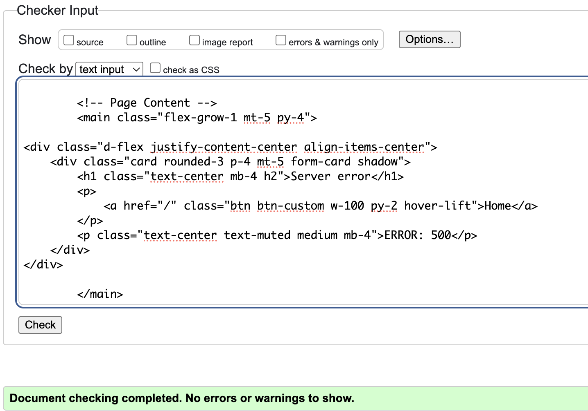 | Validated by direct input - No link |
| templates | [signup.html](https://github.com/AlexThoma5/MP4_ecommerce/blob/main/templates/account/signup.html) | [W3C Link](https://validator.w3.org/nu/?doc=https://mp4-ecommerce-390faaa8fcde.herokuapp.com/accounts/signup/&out=html) | 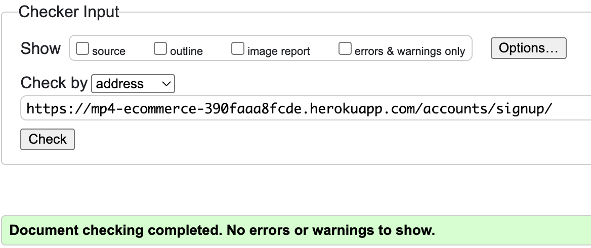 | |
| templates | [login.html](https://github.com/AlexThoma5/MP4_ecommerce/blob/main/templates/account/login.html) | [W3C Link](https://validator.w3.org/nu/?doc=https://mp4-ecommerce-390faaa8fcde.herokuapp.com/accounts/login/&out=html) | 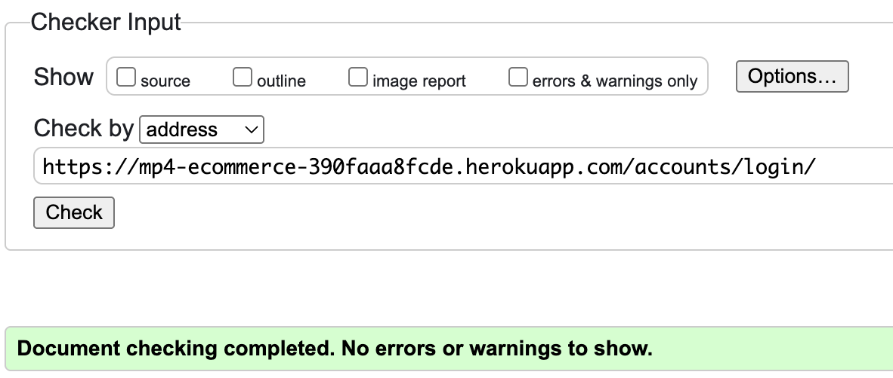 | |
| templates | [logout.html](https://github.com/AlexThoma5/MP4_ecommerce/blob/main/templates/account/logout.html) | N/A | 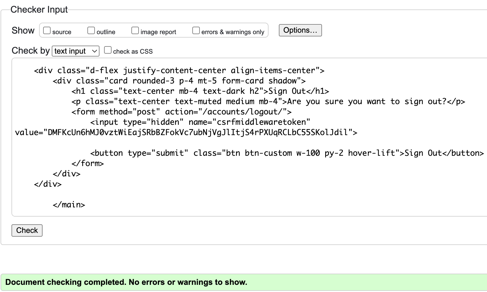 | Validated by direct input - No link |

### CSS

I have used the recommended [CSS Jigsaw Validator](https://jigsaw.w3.org/css-validator) to validate all of my CSS files.

| Directory | File | URL | Screenshot | Notes |
| --- | --- | --- | --- | --- |
| static | [base.css](https://github.com/AlexThoma5/MP4_ecommerce/blob/main/static/css/base.css) | [W3C link](https://jigsaw.w3.org/css-validator/validator?uri=https://mp4-ecommerce-390faaa8fcde.herokuapp.com/static/css/base.css&output=html) | 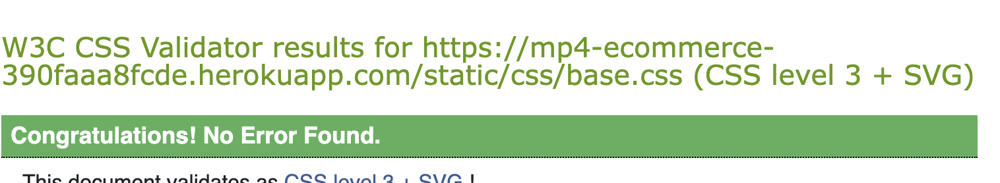 | |
| home | [home.css](https://github.com/AlexThoma5/MP4_ecommerce/blob/main/home/static/home/css/home.css) | [W3C link](https://jigsaw.w3.org/css-validator/validator?uri=https://mp4-ecommerce-390faaa8fcde.herokuapp.com/static/home/css/home.css&output=html#warnings) | 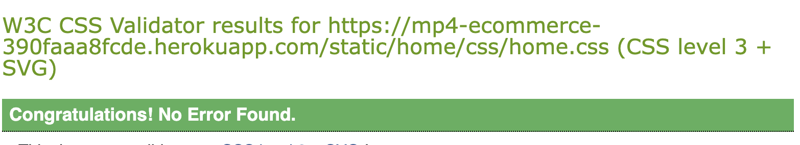 | |
| checkout | [checkout.css](https://github.com/AlexThoma5/MP4_ecommerce/blob/main/checkout/static/checkout/css/checkout.css) | N/A | 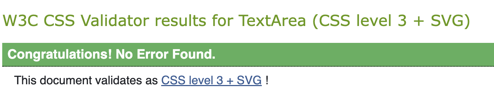 | Validated by direct input |
| services | [services.css](https://github.com/AlexThoma5/MP4_ecommerce/blob/main/services/static/services/css/services.css) | N/A | 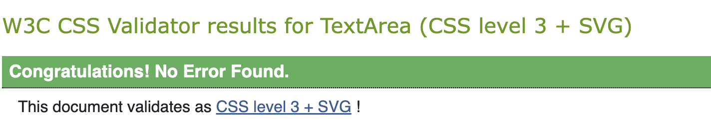 | Validated by direct input |

### JavaScript

I have used the recommended [JShint Validator](https://jshint.com) to validate all of my JS files.

| Directory | File | URL | Screenshot | Notes |
| --- | --- | --- | --- | --- |
| checkout | [stripe_elements.js](https://github.com/AlexThoma5/MP4_ecommerce/blob/main/checkout/static/checkout/js/stripe_elements.js) |  | 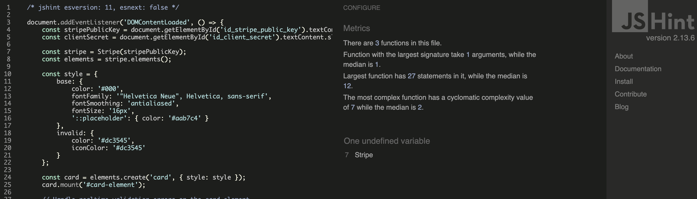 | Only warnings that show are from external libraries |
| profiles | [profile.js](https://github.com/AlexThoma5/MP4_ecommerce/blob/main/profiles/static/profiles/js/profile.js) |  | 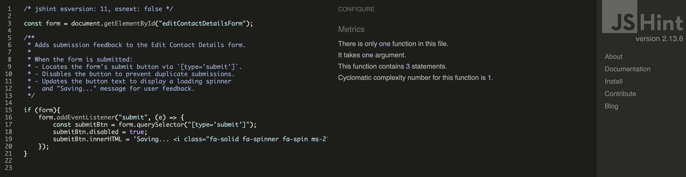 | |
| services | [services.js](https://github.com/AlexThoma5/MP4_ecommerce/blob/main/services/static/services/js/services.js) |  | 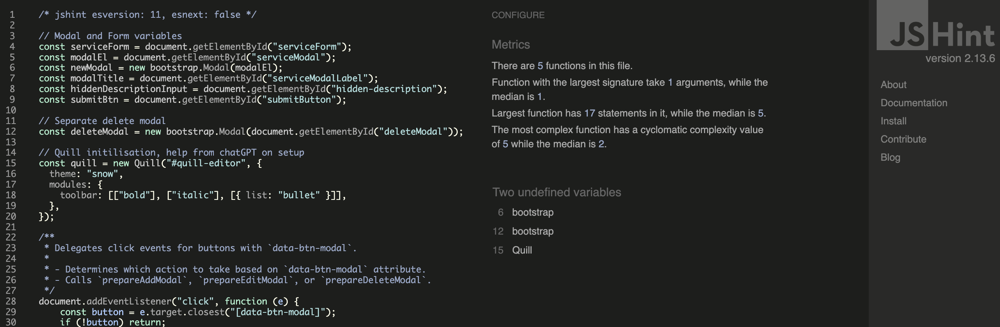 | Only warnings that show are from external libraries |
| static | [base.js](https://github.com/AlexThoma5/MP4_ecommerce/blob/main/static/js/base.js) |  | 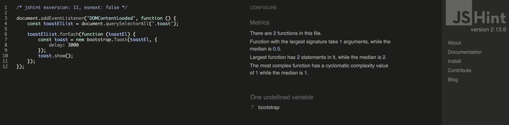 | Only warnings that show are from external libraries |

### Python

I have used the recommended [PEP8 CI Python Linter](https://pep8ci.herokuapp.com) to validate all of my Python files.

| Directory | File | URL | Screenshot |
| --- | --- | --- | --- |
| bag | [contexts.py](https://github.com/AlexThoma5/MP4_ecommerce/blob/main/bag/contexts.py) | [PEP8 CI Link](https://pep8ci.herokuapp.com/https://raw.githubusercontent.com/AlexThoma5/MP4_ecommerce/main/bag/contexts.py) | 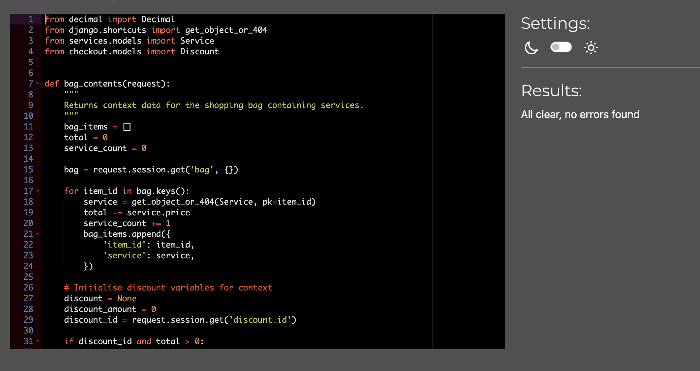 |
| bag | [urls.py](https://github.com/AlexThoma5/MP4_ecommerce/blob/main/bag/urls.py) | [PEP8 CI Link](https://pep8ci.herokuapp.com/https://raw.githubusercontent.com/AlexThoma5/MP4_ecommerce/main/bag/urls.py) | 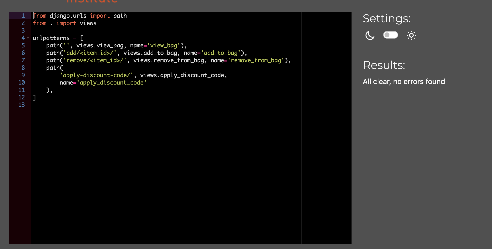 |
| bag | [views.py](https://github.com/AlexThoma5/MP4_ecommerce/blob/main/bag/views.py) | [PEP8 CI Link](https://pep8ci.herokuapp.com/https://raw.githubusercontent.com/AlexThoma5/MP4_ecommerce/main/bag/views.py) | 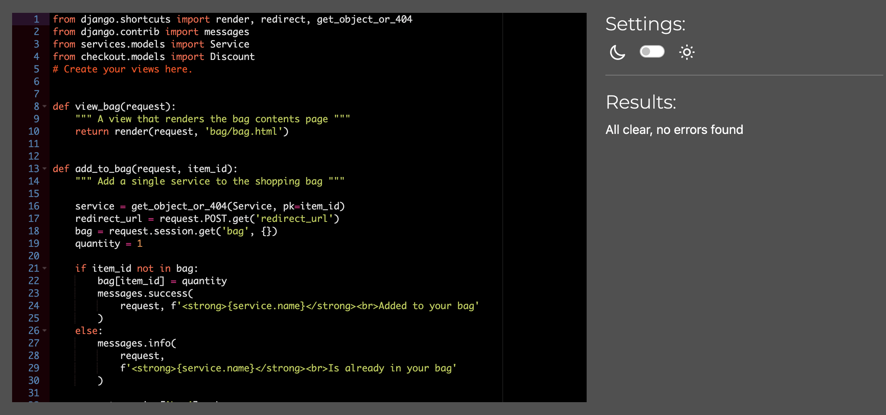 |
| checkout | [admin.py](https://github.com/AlexThoma5/MP4_ecommerce/blob/main/checkout/admin.py) | [PEP8 CI Link](https://pep8ci.herokuapp.com/https://raw.githubusercontent.com/AlexThoma5/MP4_ecommerce/main/checkout/admin.py) | 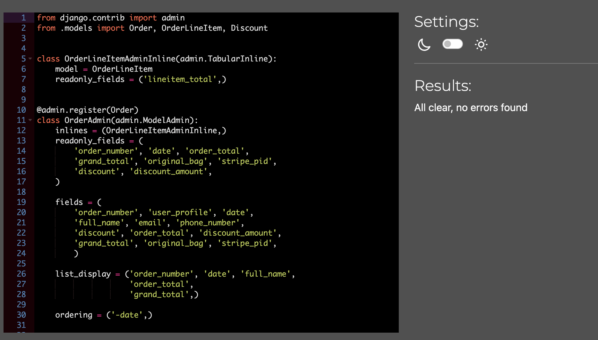 |
| checkout | [forms.py](https://github.com/AlexThoma5/MP4_ecommerce/blob/main/checkout/forms.py) | [PEP8 CI Link](https://pep8ci.herokuapp.com/https://raw.githubusercontent.com/AlexThoma5/MP4_ecommerce/main/checkout/forms.py) | 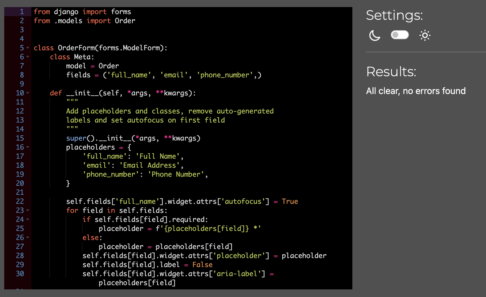 |
| checkout | [models.py](https://github.com/AlexThoma5/MP4_ecommerce/blob/main/checkout/models.py) | [PEP8 CI Link](https://pep8ci.herokuapp.com/https://raw.githubusercontent.com/AlexThoma5/MP4_ecommerce/main/checkout/models.py) | 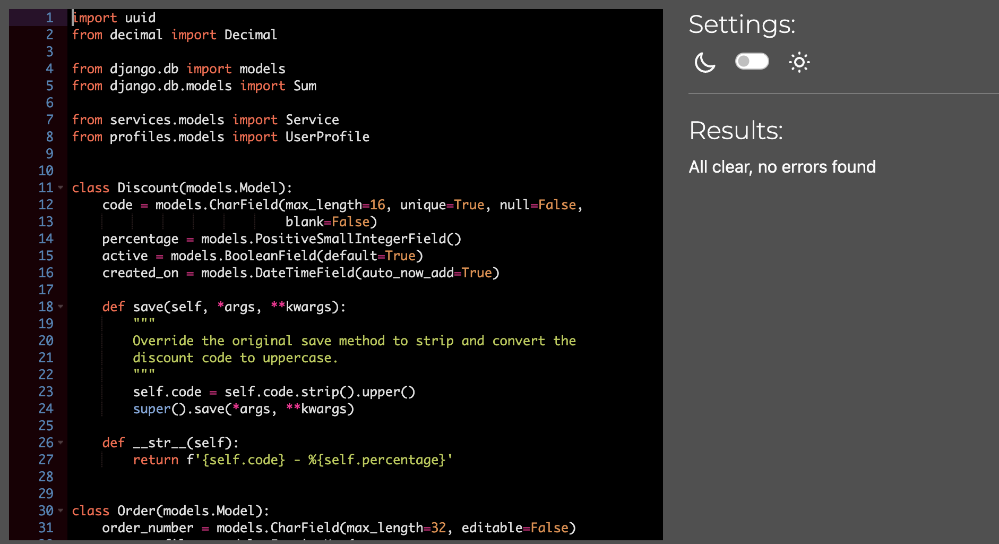 |
| checkout | [test_forms.py](https://github.com/AlexThoma5/MP4_ecommerce/blob/main/checkout/test_forms.py) | [PEP8 CI Link](https://pep8ci.herokuapp.com/https://raw.githubusercontent.com/AlexThoma5/MP4_ecommerce/main/checkout/test_forms.py) | 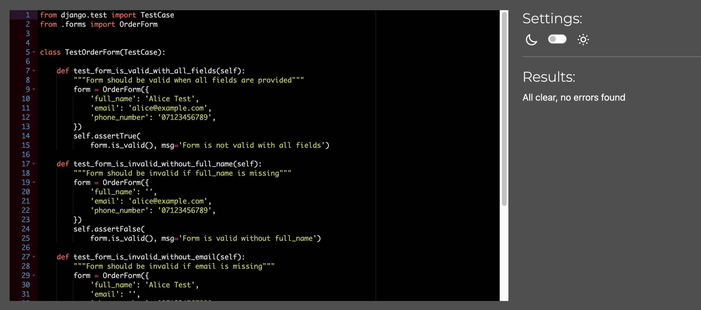 |
| checkout | [signals.py](https://github.com/AlexThoma5/MP4_ecommerce/blob/main/checkout/signals.py) | [PEP8 CI Link](https://pep8ci.herokuapp.com/https://raw.githubusercontent.com/AlexThoma5/MP4_ecommerce/main/checkout/signals.py) | 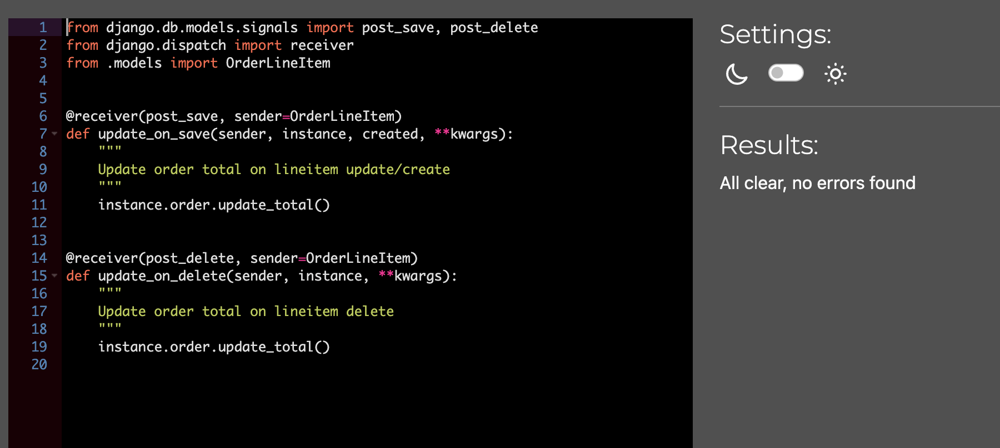 |
| checkout | [urls.py](https://github.com/AlexThoma5/MP4_ecommerce/blob/main/checkout/urls.py) | [PEP8 CI Link](https://pep8ci.herokuapp.com/https://raw.githubusercontent.com/AlexThoma5/MP4_ecommerce/main/checkout/urls.py) | 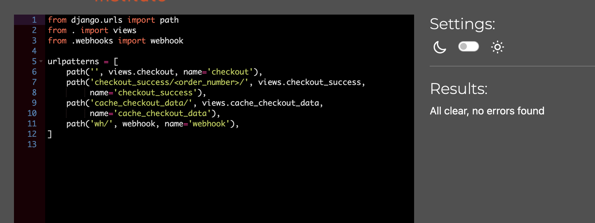 |
| checkout | [views.py](https://github.com/AlexThoma5/MP4_ecommerce/blob/main/checkout/views.py) | [PEP8 CI Link](https://pep8ci.herokuapp.com/https://raw.githubusercontent.com/AlexThoma5/MP4_ecommerce/main/checkout/views.py) | 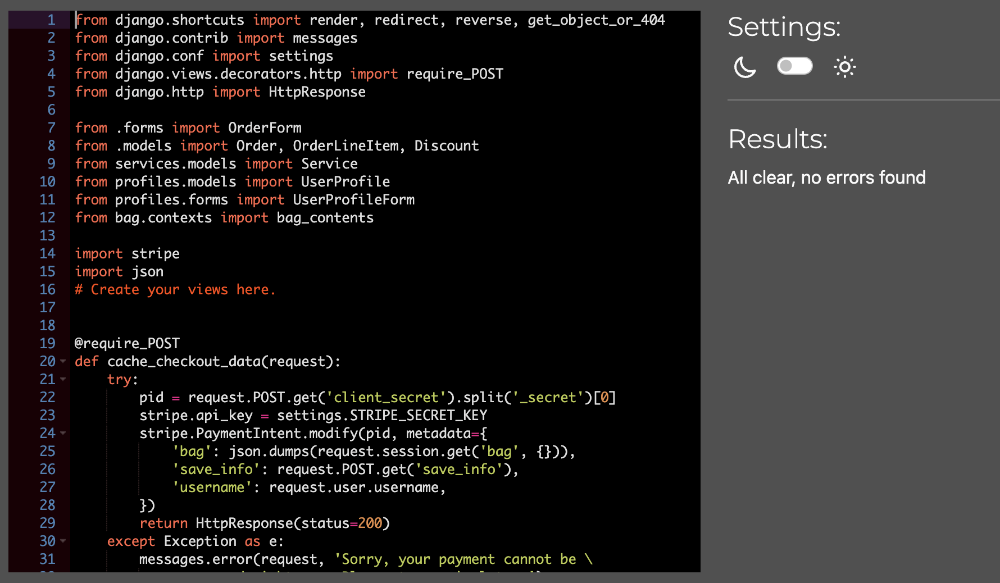 |
| checkout | [webhook_handler.py](https://github.com/AlexThoma5/MP4_ecommerce/blob/main/checkout/webhook_handler.py) | [PEP8 CI Link](https://pep8ci.herokuapp.com/https://raw.githubusercontent.com/AlexThoma5/MP4_ecommerce/main/checkout/webhook_handler.py) | 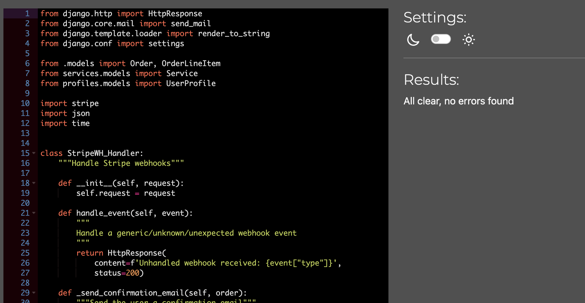 |
| checkout | [webhooks.py](https://github.com/AlexThoma5/MP4_ecommerce/blob/main/checkout/webhooks.py) | [PEP8 CI Link](https://pep8ci.herokuapp.com/https://raw.githubusercontent.com/AlexThoma5/MP4_ecommerce/main/checkout/webhooks.py) | 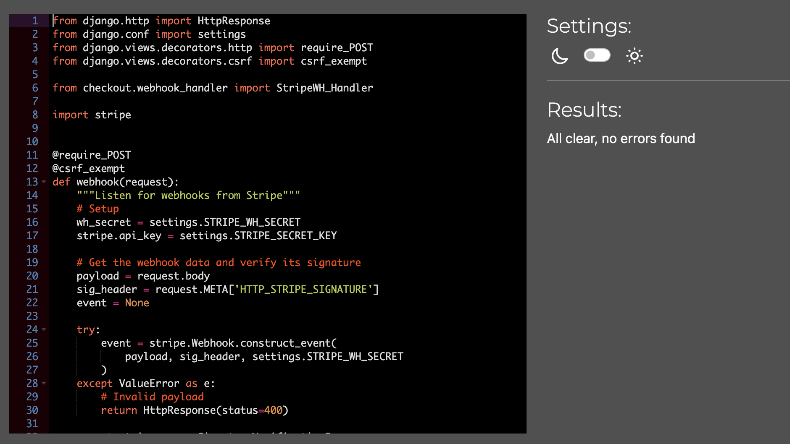 |
| contact | [admin.py](https://github.com/AlexThoma5/MP4_ecommerce/blob/main/contact/admin.py) | [PEP8 CI Link](https://pep8ci.herokuapp.com/https://raw.githubusercontent.com/AlexThoma5/MP4_ecommerce/main/contact/admin.py) | 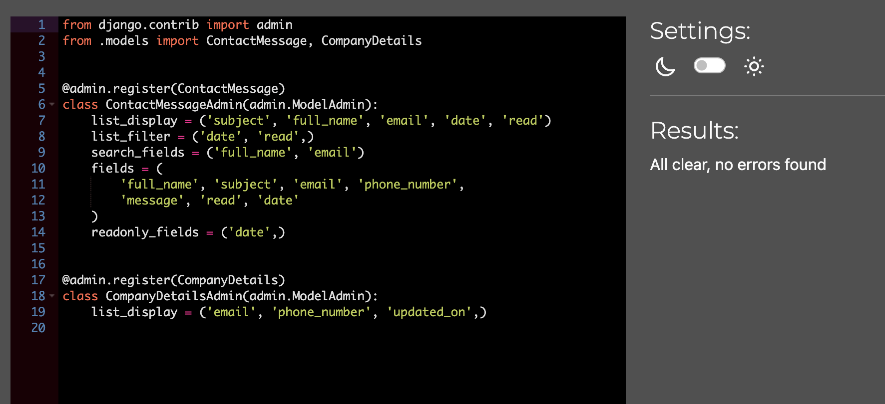 |
| contact | [forms.py](https://github.com/AlexThoma5/MP4_ecommerce/blob/main/contact/forms.py) | [PEP8 CI Link](https://pep8ci.herokuapp.com/https://raw.githubusercontent.com/AlexThoma5/MP4_ecommerce/main/contact/forms.py) | 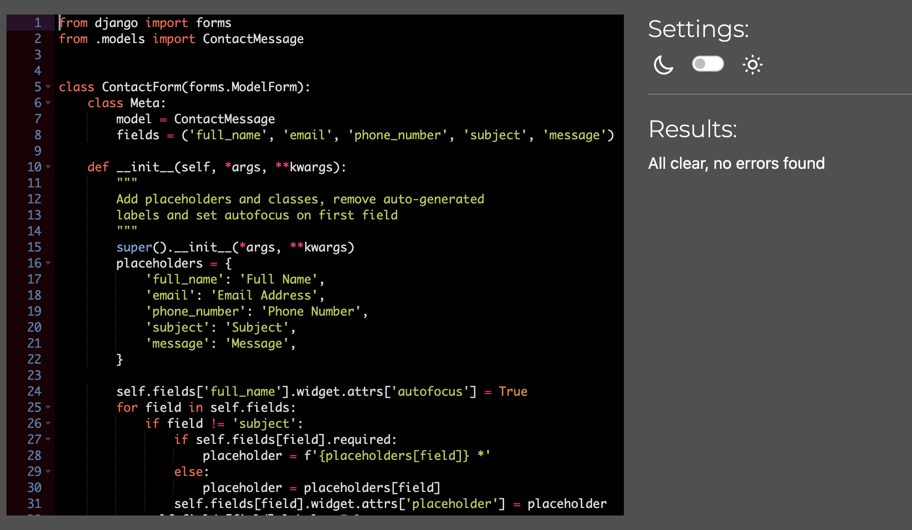 |
| contact | [models.py](https://github.com/AlexThoma5/MP4_ecommerce/blob/main/contact/models.py) | [PEP8 CI Link](https://pep8ci.herokuapp.com/https://raw.githubusercontent.com/AlexThoma5/MP4_ecommerce/main/contact/models.py) | 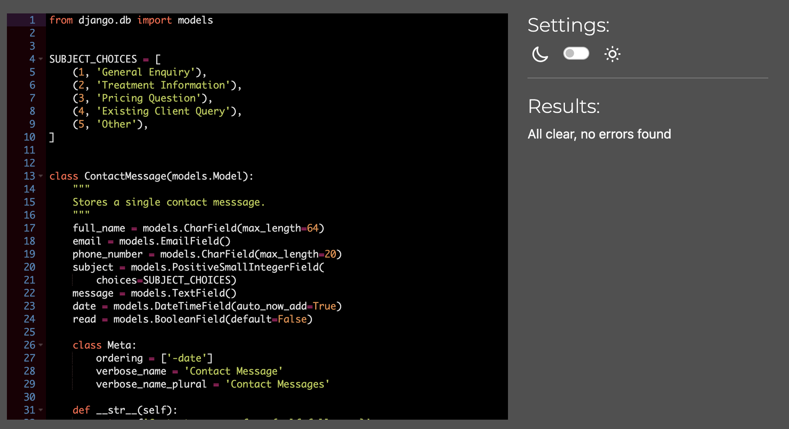 |
| contact | [test_forms.py](https://github.com/AlexThoma5/MP4_ecommerce/blob/main/contact/test_forms.py) | [PEP8 CI Link](https://pep8ci.herokuapp.com/https://raw.githubusercontent.com/AlexThoma5/MP4_ecommerce/main/contact/test_forms.py) | 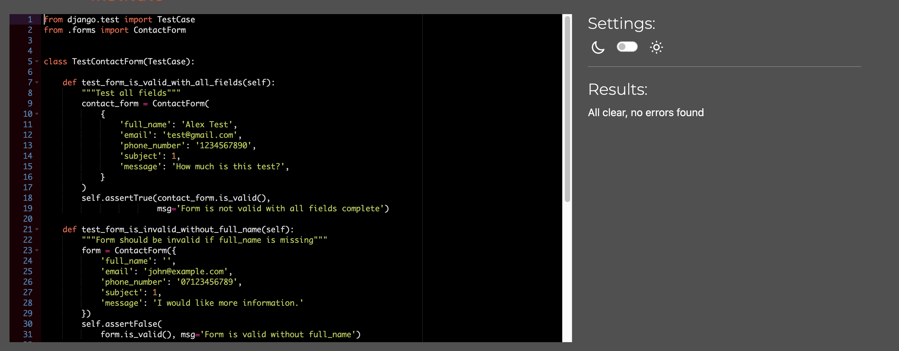 |
| contact | [urls.py](https://github.com/AlexThoma5/MP4_ecommerce/blob/main/contact/urls.py) | [PEP8 CI Link](https://pep8ci.herokuapp.com/https://raw.githubusercontent.com/AlexThoma5/MP4_ecommerce/main/contact/urls.py) | 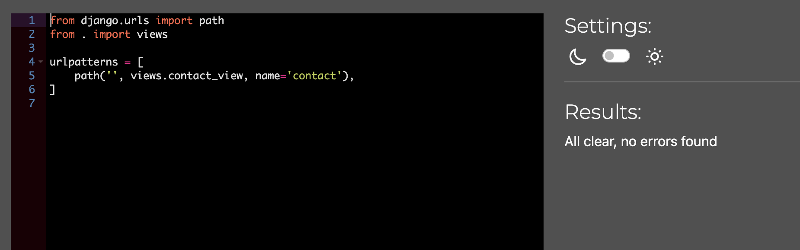 |
| contact | [views.py](https://github.com/AlexThoma5/MP4_ecommerce/blob/main/contact/views.py) | [PEP8 CI Link](https://pep8ci.herokuapp.com/https://raw.githubusercontent.com/AlexThoma5/MP4_ecommerce/main/contact/views.py) | 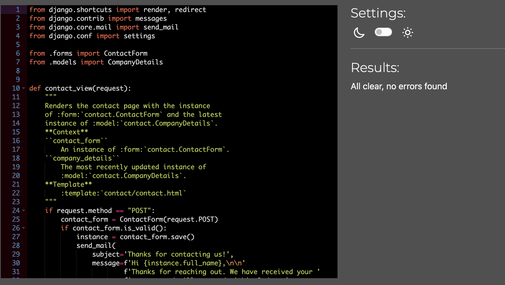 |
| home | [urls.py](https://github.com/AlexThoma5/MP4_ecommerce/blob/main/home/urls.py) | [PEP8 CI Link](https://pep8ci.herokuapp.com/https://raw.githubusercontent.com/AlexThoma5/MP4_ecommerce/main/home/urls.py) | 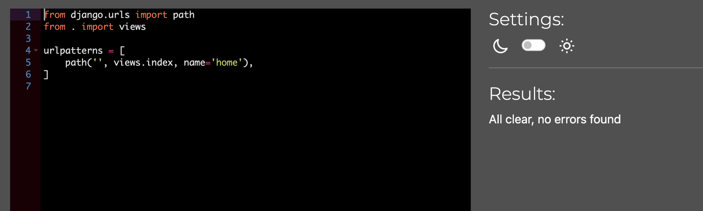 |
| home | [views.py](https://github.com/AlexThoma5/MP4_ecommerce/blob/main/home/views.py) | [PEP8 CI Link](https://pep8ci.herokuapp.com/https://raw.githubusercontent.com/AlexThoma5/MP4_ecommerce/main/home/views.py) | 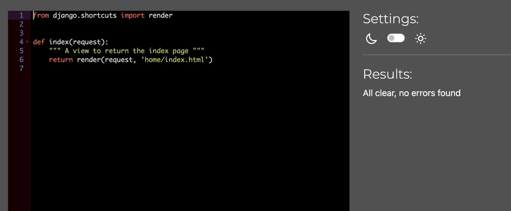 |
| main | [settings.py](https://github.com/AlexThoma5/MP4_ecommerce/blob/main/main/settings.py) | [PEP8 CI Link](https://pep8ci.herokuapp.com/https://raw.githubusercontent.com/AlexThoma5/MP4_ecommerce/main/main/settings.py) | 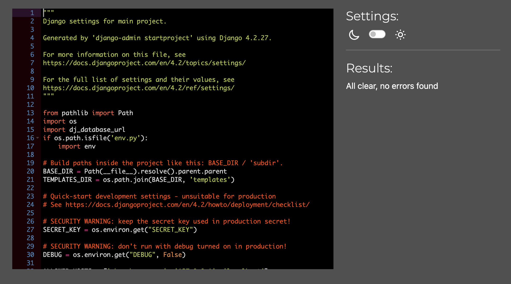 |
| main | [urls.py](https://github.com/AlexThoma5/MP4_ecommerce/blob/main/main/urls.py) | [PEP8 CI Link](https://pep8ci.herokuapp.com/https://raw.githubusercontent.com/AlexThoma5/MP4_ecommerce/main/main/urls.py) | 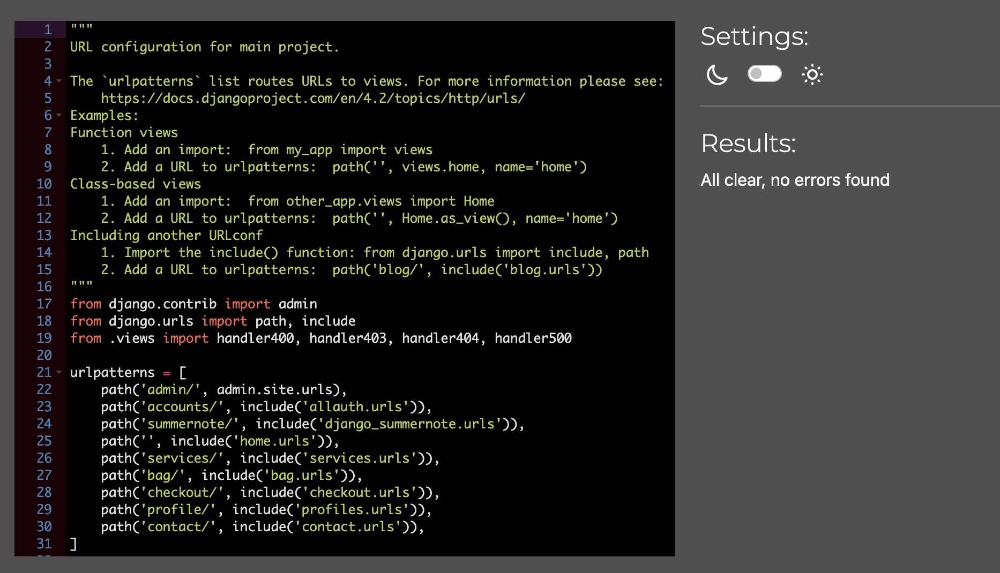 |
| main | [views.py](https://github.com/AlexThoma5/MP4_ecommerce/blob/main/main/views.py) | [PEP8 CI Link](https://pep8ci.herokuapp.com/https://raw.githubusercontent.com/AlexThoma5/MP4_ecommerce/main/main/views.py) | 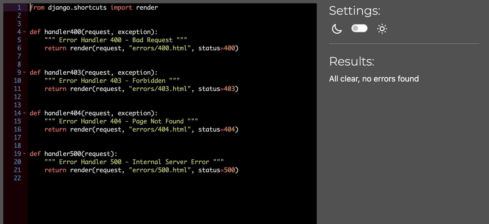 |
|  | [manage.py](https://github.com/AlexThoma5/MP4_ecommerce/blob/main/manage.py) | [PEP8 CI Link](https://pep8ci.herokuapp.com/https://raw.githubusercontent.com/AlexThoma5/MP4_ecommerce/main/manage.py) | 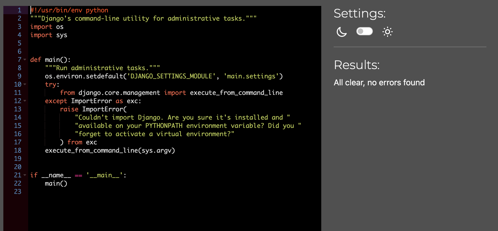 |
| profiles | [forms.py](https://github.com/AlexThoma5/MP4_ecommerce/blob/main/profiles/forms.py) | [PEP8 CI Link](https://pep8ci.herokuapp.com/https://raw.githubusercontent.com/AlexThoma5/MP4_ecommerce/main/profiles/forms.py) | 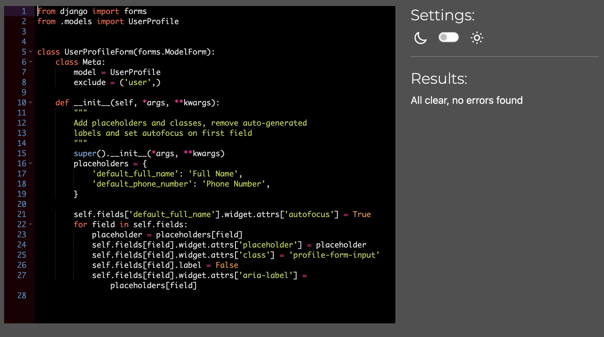 |
| profiles | [models.py](https://github.com/AlexThoma5/MP4_ecommerce/blob/main/profiles/models.py) | [PEP8 CI Link](https://pep8ci.herokuapp.com/https://raw.githubusercontent.com/AlexThoma5/MP4_ecommerce/main/profiles/models.py) | 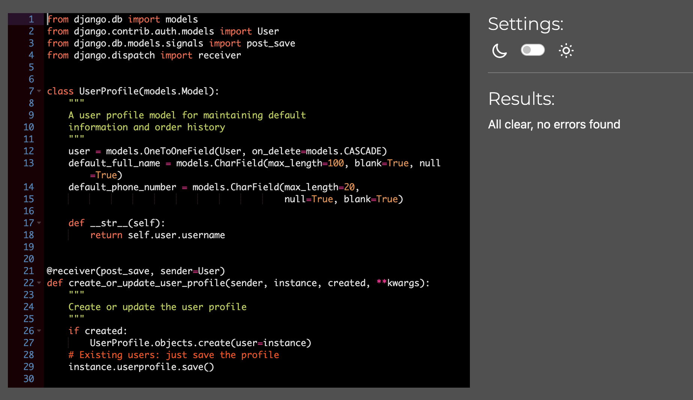 |
| profiles | [test_forms.py](https://github.com/AlexThoma5/MP4_ecommerce/blob/main/profiles/test_forms.py) | [PEP8 CI Link](https://pep8ci.herokuapp.com/https://raw.githubusercontent.com/AlexThoma5/MP4_ecommerce/main/profiles/test_forms.py) | 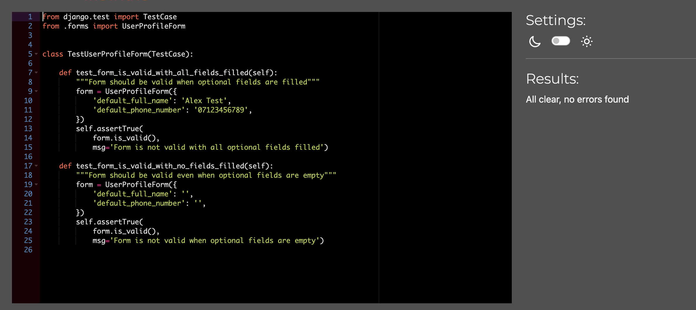 |
| profiles | [urls.py](https://github.com/AlexThoma5/MP4_ecommerce/blob/main/profiles/urls.py) | [PEP8 CI Link](https://pep8ci.herokuapp.com/https://raw.githubusercontent.com/AlexThoma5/MP4_ecommerce/main/profiles/urls.py) |  |
| profiles | [views.py](https://github.com/AlexThoma5/MP4_ecommerce/blob/main/profiles/views.py) | [PEP8 CI Link](https://pep8ci.herokuapp.com/https://raw.githubusercontent.com/AlexThoma5/MP4_ecommerce/main/profiles/views.py) |  |
| services | [admin.py](https://github.com/AlexThoma5/MP4_ecommerce/blob/main/services/admin.py) | [PEP8 CI Link](https://pep8ci.herokuapp.com/https://raw.githubusercontent.com/AlexThoma5/MP4_ecommerce/main/services/admin.py) |  |
| services | [forms.py](https://github.com/AlexThoma5/MP4_ecommerce/blob/main/services/forms.py) | [PEP8 CI Link](https://pep8ci.herokuapp.com/https://raw.githubusercontent.com/AlexThoma5/MP4_ecommerce/main/services/forms.py) |  |
| services | [models.py](https://github.com/AlexThoma5/MP4_ecommerce/blob/main/services/models.py) | [PEP8 CI Link](https://pep8ci.herokuapp.com/https://raw.githubusercontent.com/AlexThoma5/MP4_ecommerce/main/services/models.py) |  |
| services | [test_forms.py](https://github.com/AlexThoma5/MP4_ecommerce/blob/main/services/test_forms.py) | [PEP8 CI Link](https://pep8ci.herokuapp.com/https://raw.githubusercontent.com/AlexThoma5/MP4_ecommerce/main/services/test_forms.py) |  |
| services | [urls.py](https://github.com/AlexThoma5/MP4_ecommerce/blob/main/services/urls.py) | [PEP8 CI Link](https://pep8ci.herokuapp.com/https://raw.githubusercontent.com/AlexThoma5/MP4_ecommerce/main/services/urls.py) |  |
| services | [views.py](https://github.com/AlexThoma5/MP4_ecommerce/blob/main/services/views.py) | [PEP8 CI Link](https://pep8ci.herokuapp.com/https://raw.githubusercontent.com/AlexThoma5/MP4_ecommerce/main/services/views.py) |  |

## Responsiveness

I've tested my deployed project to check for responsiveness issues. To carry out these tests I used Google Chrome's device emulator. The three devices I chose to use were:

| Device              | CSS Viewport (Width × Height) | Notes                              |
|---------------------|-------------------------------|------------------------------------|
| iPhone 14 Pro Max   | 430 × 932                     | Chrome DevTools preset             |
| iPad Mini           | 768 × 1024                    | Chrome DevTools preset             |
| MacBook Air (full screen) | ~1470 × 956              | Actual viewport in Chrome window   |

| Page | Mobile | Tablet | Desktop | Notes |
| --- | --- | --- | --- | --- |
| Home |  |  |  | Works as expected |
| Services |  |  |  | Works as expected |
| Service Details |  |  |  | Works as expected |
| Bag |  |  |  | Works as expected |
| Checkout |  |  |  | Works as expected |
| Checkout Success |  |  |  | Works as expected |
| Profile |  |  |  | Works as expected |
| Add Service Modal |  |  |  | Works as expected |
| Edit Service Modal |  |  |  | Works as expected |Service
| Register |  |  |  | Works as expected |
| Login |  |  |  | Works as expected |
| Logout |  |  |  | Works as expected |
| Contact |  |  |  | Works as expected |
| 404 |  |  |  | Works as expected |

## Browser Compatibility

For testing the live/deployed site, I used three different browsers: Google Chrome, Safari, and Mozilla Firefox. The goal was to ensure consistent functionality, layout, and performance across multiple environments.

| Page | Chrome | Firefox | Safari | Notes |
| --- | --- | --- | --- | --- |
| Home |  |  |  | Works as expected |
| Services |  |  |  | Works as expected |
| Service Details |  |  |  | Works as expected |
| Bag |  |  |  | Works as expected |
| Checkout |  |  |  | Works as expected |
| Checkout Success |  |  |  | Works as expected |
| Add Service Modal |  |  |  | Works as expected |
| Edit Service Modal |  |  |  | Works as expected |
| Profile |  |  |  | Works as expected |
| Contact |  |  |  | Works as expected |
| Register |  |  |  | Works as expected |
| Login |  |  |  | Works as expected |
| Logout |  |  |  | Works as expected |
| 404 |  |  |  | Works as expected |

## Lighthouse Audit

I've tested my deployed project using the Lighthouse Audit tool to check for any major issues. Overall, the audit helped me catch performance, accessibility, and SEO improvements to make the app more reliable and user-friendly.

Some lower scores, such as the Best Practices metric, were caused by third-party resources like Stripe and Cloudinary, which are outside of my control.

| Page | Mobile | Desktop |
| --- | --- | --- |
| Home |  |  |
| Services |  [!IMPORTANT] CRUD Modals are included within the services page|  [!IMPORTANT] CRUD Modals are included within the services page|
| Service Details |  |  |
| Bag |  |  |
| Checkout |  |  |
| Checkout Success |  |  |
| Profile |  |  |
| Contact |  |  |
| Register |  |  |
| Login |  |  |
| 404 |  |  |

## Defensive Programming

Defensive programming focuses on ensuring data integrity, user access control, and secure input validation across the Motion Lab site. All forms and CRUD operations were manually tested to confirm that unauthorised or invalid actions are correctly restricted.

When developing Motion Lab, multiple layers of defensive programming were implemented — including the use of the @login_required decorator to protect authorised pages, validation checks within views to ensure user == request.user, and conditional logic in Django templates using if request.user.is_superuser to restrict access to superuser-only functionality.

Defensive programming was manually tested with the below user acceptance testing:

| Page | Expectation | Test | Result | Screenshot |
| --- | --- | --- | --- | --- |
| services | Feature is expected to allow users to browse services without registration. | Opened service pages as a guest user. | services were fully accessible without requiring registration. |  |
| | Feature is expected to show detailed service information. | Clicked on individual services to view details. | service details (description, price, image) were displayed correctly. |  |
| Shopping bag | Feature is expected to allow customers to add items to the bag. | Added services to the bag. | Services were added successfully. |  |
| | Feature is expected to allow customers to view and manage their bag. | Opened the bag page and edited bag contents. | Bag contents were displayed and removed correctly. |  |
| | Feature is expected to allow customers to apply a discount to their bag. | Added discount on bag page. | Discount is displayed and grand total is updated. |  |
| Checkout | Feature is expected to display bag items, grand total, and input fields for checkout. | Proceeded to checkout with items in the bag. | Checkout page displayed bag items, total, and input fields as expected. |  |
| | Feature is expected to allow secure payment via Stripe. | Entered valid card details using Stripe at checkout. | Payment was processed securely, and an order confirmation page was displayed. |  |
| | Feature is expected to send a confirmation email after purchase. | Completed a purchase and checked email inbox. | Confirmation email was received with order details. |  |
| | Feature is expected to display an order confirmation page with an order number. | Completed a purchase. | Order confirmation page displayed successfully with an order number. |  |
| Account Management | Feature is expected to allow returning customers to log in and view past orders. | Logged in as a returning customer and accessed order history. | Past orders were displayed correctly in the account section. |  |
| | Feature is expected to remember the shipping address for returning customers. | Completed multiple checkouts as a returning customer. | Shipping address was pre-filled on subsequent purchases. |  |
| | Feature is expected to allow users to edit their account details on profile page. | Changed account details on profile page. | Account details section reflected chnages. |  |
| Admin Features | Feature is expected to allow the site owner to create new services. | Created new services with valid data (name, price, description, image, category). | services were added successfully and displayed on the site. |  |
| | Feature is expected to allow the site owner to update service details. | Edited service details as an admin user. | service updates were saved and displayed correctly. |  |
| | Feature is expected to allow the site owner to delete services. | Deleted a service from the inventory. | service was removed successfully from the site, after being prompted to confirm first. |  |
| | Feature is expected to admins to edit company details. | Changed company details via admin panel. | New changes were updated on site. |  |
| Orders | Feature is expected to allow the site owner to view all orders placed. | Accessed the orders dashboard as an admin user. | All orders were displayed correctly. |  |
| Contact | Feature is expected to allow users to send a contact message to site owners | Completed contact form and submitted it. | Message was successfully sent and success toast shows |  |
| | Feature is expected to send a confirmation email after contact message is sent. | Completed a contact message and checked email inbox. | Confirmation email was received. |  |
| 404 Error Page | Feature is expected to display a 404 error page for non-existent pages. | Navigated to an invalid URL (e.g., `/test`). | A custom 404 error page was displayed as expected. |  |

## User Story Testing

| Target | Expectation | Outcome | Screenshot |
| --- | --- | --- | --- |
| As a guest user | I would like to browse physiotherapy services without needing to register | so that I can explore available treatments before deciding to create an account. |  |
| As a guest user | I would like to be prompted to create an account or log in at checkout | so that I can complete my purchase and access my service purchase history. |  |
| As a customer | I would like to both in-person and virtual service options | so that I can have flexibility with my treatments. |  |
| As a customer | I would like to click on an individual service to view more details (description, duration, price) | so that I can make an informed decision before purchasing. |  |
| As a customer | I would like to remove services from my bag | so that I can change my mind before completing payment. |  |
| As a customer | I would like to proceed to checkout where I can see my selected services, total cost, and enter my personal and payment details | so that I can complete my purchase securely. |  |
| As a customer | I would like to securely enter my card details using Stripe at checkout | so that I can feel confident that my payment information is protected. |  |
| As a customer | I would like to receive a confirmation email after my purchase | so that I have a record of my transaction and service details. |  |
| As a customer | I would like to see an order confirmation page with an order number after completing my purchase | so that I know my transaction was successful. |  |
| As a returning customer | I would like to log in and view my past service purchases | so that I can keep track of my treatment history. |  |
| As a returning customer | I would like my personal details to be remembered at checkout | so that future purchases are quicker and more convenient. |  |
| As a site owner | I would like to create new physiotherapy services with a name, description, price, duration, images and service type | so that I can expand the services offered by the clinic. |  |
| As a site owner | I would like to update service details (name, price, description, duration, image, service type) at any time | so that I can keep listings accurate and up to date. |  |
| As a site owner | I would like to delete services that are no longer offered | so that I can maintain a clear and relevant service list. |  |
| As a site owner | I would like to manage the clinic’s company details (e.g., address, email, opening hours, and phone number) | so that customers always have access to accurate and up-to-date information. |  |
| As a site owner | I would like to view all customer orders | so that I can track and manage service purchases. |  |
| As a site owner | I would like to offer promotional codes | so that customers are more likely to purchase services. |  |
| As a user | I would like to see a custom 404 error page if I navigate to a non-existent page | so that I clearly understand the page cannot be found and can return to the site easily. |  |
| As a user | I would like to fill out a contact form to send a message to the clinic | so that I can easily make enquiries or request further information. |  |
## Automated Testing

I have conducted a series of automated tests on my application.

> [!NOTE]  
> I fully acknowledge and understand that, in a real-world scenario, an extensive set of additional tests would be more comprehensive.

### Python (Unit Testing)

A series of 17 automated tests have been conducted on the application, covering:

Forms: All forms in the `checkout`, `contact`, `profiles` and `services` apps.

Due to time constraints and the complexity of some views, this project focuses automated testing on forms, ensuring that required and optional fields are validated correctly.

I have used Django's built-in unit testing framework to test the application functionality. In order to run the tests, I ran the following command in the terminal:

- `python3 manage.py test`

All form validation behaves as expected. All tests ran 'OK'.


To create the coverage report, I would then run the following commands:

- `pip3 install coverage`
- `pip3 freeze --local > requirements.txt`
- `coverage run --omit="*/site-packages/*,*/migrations/*,*/__init__.py,env.py,.env" manage.py test`
- `coverage report`

To see the HTML version of the reports, and find out whether some pieces of code were missing, I ran the following commands:

- `coverage html`
- `python3 -m http.server`
- I then filtered for `forms`

Coverage results for the application, filtered to the forms module only:


## Bugs

### Fixed Bugs

I've used [GitHub Issues](https://www.github.com/AlexThoma5/MP4_ecommerce/issues) to track and manage bugs and issues during the development stages of my project.

All previously closed/fixed bugs can be tracked [here](https://www.github.com/AlexThoma5/MP4_ecommerce/issues?q=is%3Aissue+is%3Aclosed+label%3Abug).


### Unfixed Bugs

Any remaining open issues can be tracked [here](https://www.github.com/AlexThoma5/MP4_ecommerce/issues?q=is%3Aissue+is%3Aopen+label%3Abug).

> [!IMPORTANT]  
> There are no remaining bugs that I am aware of, though, even after thorough testing, I cannot rule out the possibility.

### Known Issues

| Issue | Screenshot |
| --- | --- |
| With a known order-number, users can brute-force "checkout_success.html" and see potentially sensitive information. |  |
| The project is designed to be responsive from `375px` and upwards, in line with the material taught on the course LMS. Minor layout inconsistencies may occur on extra-wide (e.g. 4k/8k monitors), or smart-display devices (e.g. Nest Hub, Smart Watches, Gameboy Color, etc.), as these resolutions are outside the project’s scope, as taught by Code Institute. |  |
| If a service is in your bag/cart, but then gets deleted from the database, it throws errors from the session storage memory. |  |
| Occasionally, when logging into different accounts using Safari on iPhone, a CSRF token error may occur. This is due to how Safari on iOS handles cookies and cached session data. Refreshing the page resolves the issue. | N/A |
